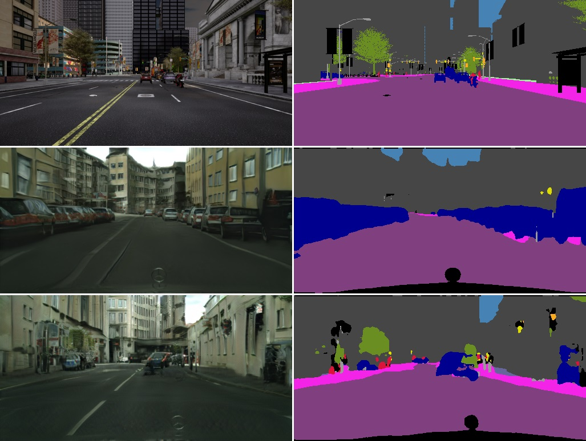
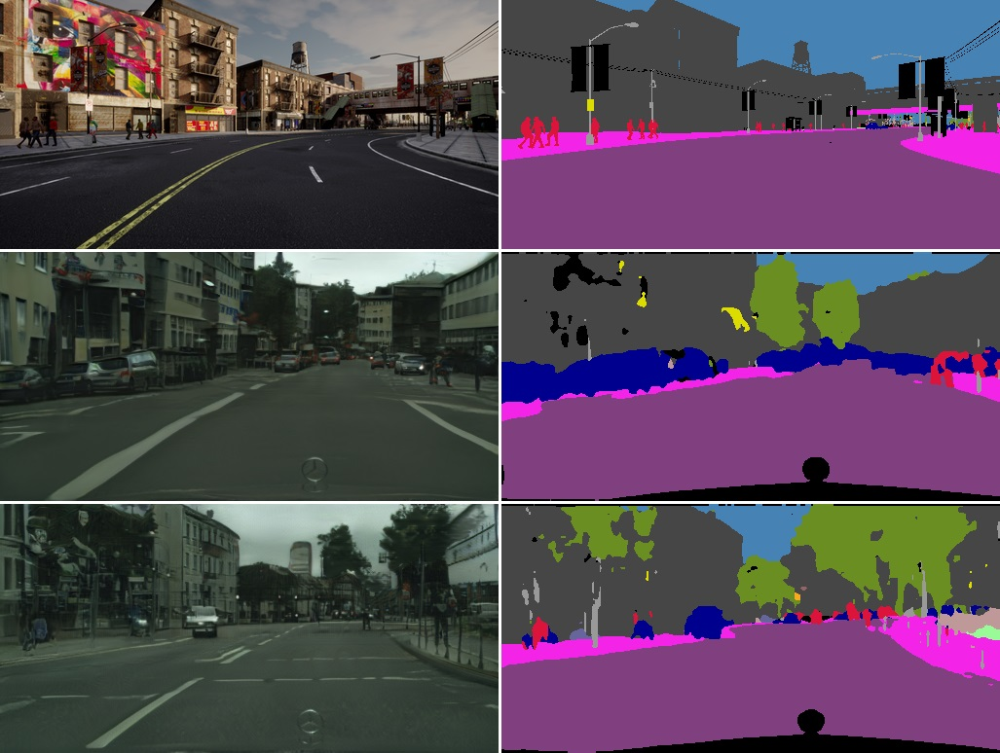
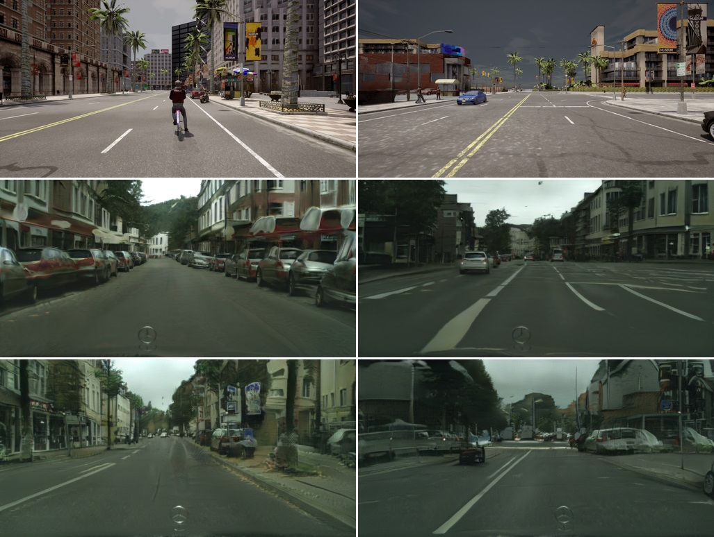

# Label-Consistent Swapping Autoencoder 

## Further visualizations

Additional results with the &lambda;out = 3 model:

Translation results with another (&lambda;in = &lambda;out = 2) model:

Further visualizations (failure cases):

